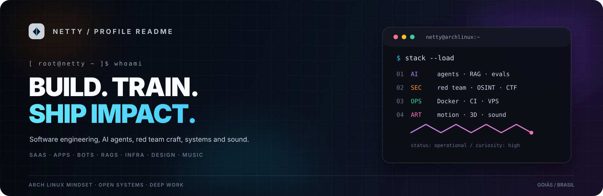
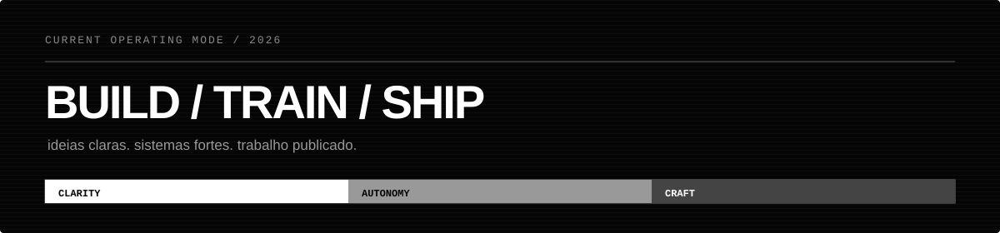
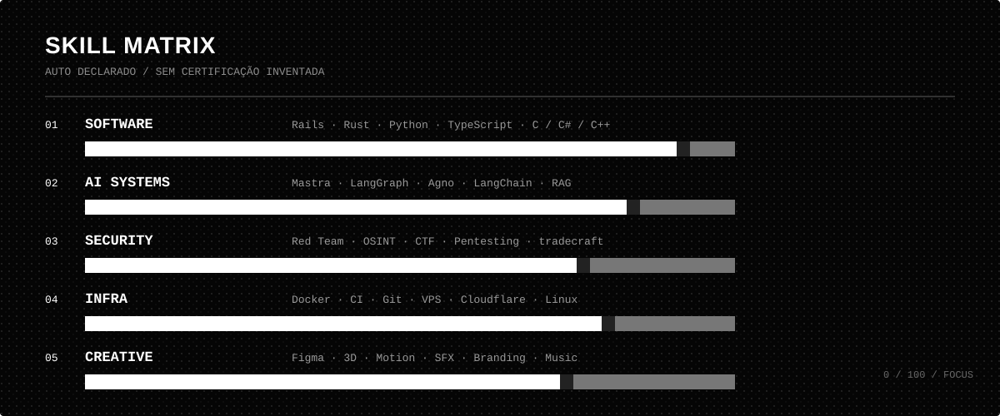

<div align="center">
  
</div>

<br />

<div align="center">
  <a href="https://nettydev.nullysh.com/"></a>
  <a href="https://github.com/netty-linux"></a>
  <a href="https://github.com/netty-linux?tab=repositories"></a>
  
</div>

<h1 align="center">DEUS EX MACHINA</h1>

<p align="center">
  <strong>Software engineer, AI builder, red team practitioner and creative technologist.</strong><br />
  Transformo ideias em sistemas que funcionam, aprendem e chegam ao mundo real.
</p>

<p align="center">
  <a href="https://nettydev.nullysh.com/">Portfolio</a> ·
  <a href="https://github.com/netty-linux/portfolio">Portfolio source</a> ·
  <a href="mailto:elevateiamedusax@gmail.com">Email</a> ·
  <a href="https://www.instagram.com/netty.dev/">Instagram</a>
</p>

<br />

<div align="center">
  
</div>

---

## `/usr/bin/netty`

Sou um construtor multidisciplinar com foco em **engenharia de software, inteligência artificial aplicada, segurança ofensiva, infraestrutura e direção criativa**.

Gosto de sistemas com ponta a ponta: uma ideia clara, uma interface forte, uma arquitetura que aguenta pressão e um deploy que realmente chega em produção.

<div align="center">
  
</div>

## Stack principal

### Engenharia de software

<div>
  
  
  
  
  
  
  
</div>

### AI engineering e agentes

<div>
  
  
  
  
  
  
</div>

**Especialidades:** SaaS, apps, bots, automações, frameworks, pipelines, RAGs, ferramentas MCP, avaliação e treinamento de agentes.

### Infraestrutura e entrega

<div>
  
  
  
  
  
  
</div>

Domínio em containers, CI/CD, Git, deploys, cloud VPS, observabilidade e automações de infraestrutura.

## Skill matrix

<div align="center">
  
</div>

> Mapa de foco auto declarado. Os badges de segurança abaixo representam prática e áreas de estudo, não certificações oficiais.

### Segurança ofensiva

<div>
  
  
  
  
  
</div>

Prática em **red team, pentesting, OSINT, técnicas de investigação e tradecraft**. Se você tiver links de badges, rankings ou perfis oficiais, posso substituir estes badges de foco por badges verificáveis.

### Formação

<div>
  
  
</div>

Cursando **Engenharia de Redes Neurais** na Faculdade FAMA Goiás.

## Creative lab

<div>
  
  
  
  
  
</div>

- **SFX:** designer de efeitos sonoros e produtor musical
- **Design gráfico:** Figma, Adobe Illustrator, vetorização, 3D e motion
- **Branding:** sistemas visuais, direção de marca e posicionamento
- **Produção:** sound design, composição, edição e experiências audiovisuais

## Ferramentas que fazem parte do meu laboratório

<div>
  
  
  
  
  
  
  
  
  
  
  
  
  
  
</div>

## Activity

<div align="center">
  
  
</div>

<div align="center">
  
</div>

## Current operating mode

```text
[online]
focus      = build useful systems
interface  = terminal first, visual when it matters
principles = clarity, autonomy, security, craft
location   = Goiás, Brasil
status     = shipping
```

<div align="center">
  <sub>Construído com curiosidade, sistemas abertos e atenção aos detalhes.</sub>
</div>
